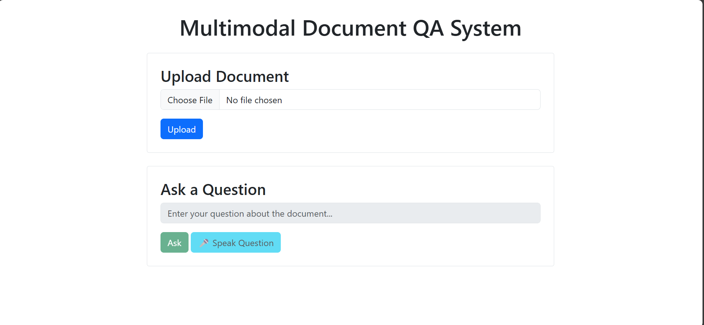
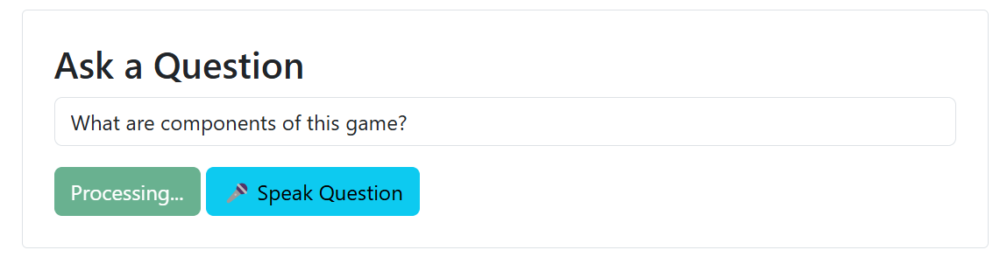
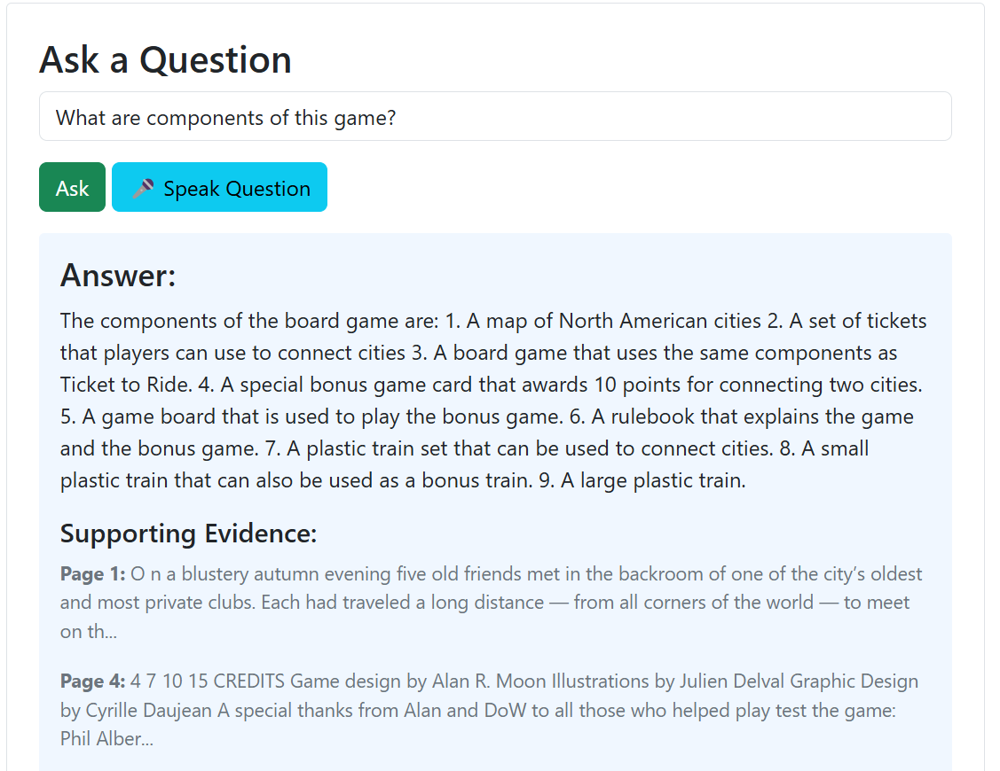

# Multimodal Document QA System 📑✨

A Flask-based web application that processes documents (PDFs) and answers questions using text and image content. Supports text-based and voice-based queries with real-time responses, leveraging NLP and computer vision techniques.

## 🌟 Features

- **📄 Document Processing**
  - PDF and image file support (JPG, PNG, JPEG)
  - Text extraction with OCR for images
  - Image extraction and captioning
- **🔍 Semantic Search**
  - Context-aware question processing
  - Hybrid text and image retrieval
- **🤖 Intelligent Answer Generation**
  - OPT-1.3b language model for high-quality answers
  - Context-aware response generation
- **🎙️ Voice Interaction**
  - Voice question input
  - Audio answer output
- **📊 Evidence Presentation**
  - Shows supporting text passages
  - Displays relevant images with captions

## 🛠 Tech Stack

| Component               | Technology                                   |
|-------------------------|----------------------------------------------|
| Frontend                | HTML, Bootstrap, JavaScript                  |
| Backend                 | Python 3.9+, Flask                           |
| Document Processing      | PyMuPDF, pytesseract, Pillow                |
| NLP Models              | OPT-1.3b, BERT                               |
| Computer Vision         | PyMuPDF, ResNet50, ViT-GPT2 Image Captioning |
| Voice Processing        | SpeechRecognition, gTTS                      |
| Vector Similarity       | PyTorch, cosine similarity                   |
| Package Manager         | pip     

## 🚀 Getting Started

### Prerequisites
- **Python 3.9+**
- **pip package manager**
- **Tesseract-OCR** (for image text extraction, install separately)
- **FFmpeg** (for audio processing)

### Installation

1. **Clone the repository**
    ```bash
    git clone https://github.com/PoorvikaGowda23/Multimodal-QA
    cd Multimodal-QA
2. **Install dependencies**
    ```bash
    pip install -r requirements.txt
    ```
    
3. **Run the application**
    ```bash
    python app.py
    ```

4. **Access the application**
    Open [http://localhost:5000](http://localhost:5000) in your browser.

```
multimodal-document-qa/
│
├── app.py                  # Main Flask application
├── document_processor.py   # Document preprocessing (PDFs/Images)
├── question_processor.py   # Question analysis with BERT
├── retrieval_engine.py     # Semantic retrieval for text/images
├── answer_generator.py     # Answer generation with OPT-1.3B
├── audio_processor.py      # Audio transcription and speech generation
├── utils/                  # Helper functions (image captioning, text chunking)
│   ├── image_captioning.py
│   └── text_chunking.py
├── templates/              # HTML templates
│   └── index.html
├── temp/                   # Temporary file storage (auto-created)
├── README.md               # Project documentation
└── requirements.txt        # Python dependencies
```


## 📝 Usage

### 🆕 Upload a Document
1. Click "Choose File" and select a PDF or image file

     
   
3. Click "Upload" to process the document

    
   
4. System will display document metadata (pages, images)

### ❓ Ask Questions
#### Text Input:
1. Type your question in the text box
2. Click "Ask" to get the answer

     
   
#### 🎤 Voice Input:
1. Click the microphone button 🎤
2. Speak your question clearly
3. System will transcribe and answer

### 👀 Review Answers
- The system displays:
  - Generated answer
  - Supporting text passages

    
  - Relevant images with captions
- Answers can be played as audio

## 🔧 Troubleshooting

### 🚨 Document Processing Errors
- Ensure files are valid PDFs or images
- Check Tesseract OCR is installed for image processing
- Verify sufficient disk space for temporary files

### 🚨 Model Loading Issues
- Check internet connection for first-time model downloads
- Ensure at least 8GB RAM available for large models
- Verify CUDA is available if using GPU

### 🚨 Voice Processing Problems
- Check microphone permissions in browser
- Ensure quiet environment for voice input
- Verify FFmpeg is installed for audio processing

